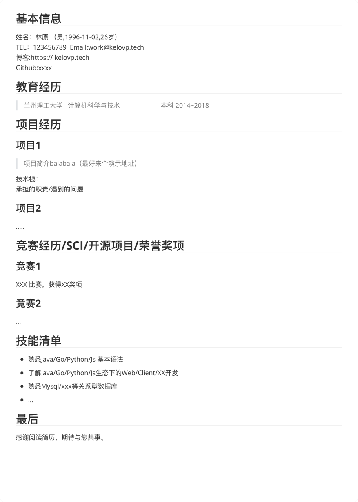

# 如何写简历
这里介绍一下如何写简历，简历作为用人方了解你的窗口，一定要简明扼要，用最短的篇幅（推荐一页左右，太长🐶都不看）陈述既有价值，展现自己的技能和良好的素养。基本内容如下：

### 关于照片和学校简介

一般研发岗位的简历不需要贴照片除非你觉得你的长相会是你面试的加分项（会有谁讨厌帅哥美女呢？），但是我觉得照片会占用一些不必要的空间且也说明不了什么内容。所以在个人信息一栏说清楚自己的姓名、性别、年龄
联系方式、博客/项目主页地址就ok。

而学校部分因为是双非建议只需要表明本科、所学的专业、毕业时间（入学~毕业），不建议把所修课程写进去，因为如果后面的部分过于单薄你写的科目就是你的面试内容。

### 竞赛经历

如果你恰巧有专业相关的竞赛经历那可太好了，写上比赛的比赛内容，陈述自己在队内的作用，介绍项目的难点和技术栈，说明使用什么样的方式解决了什么问题。这块如果有多个那就挑2~3个，其中1个重点说明，用来展示你在本科阶段的所学和已经掌握的技能。

### 校内项目

假如在写完学校一栏之后你很倒霉，直接快进到这一项了，那你就得花点功夫点缀一下这块了。先说几个巨大的雷区：比如前端千篇一律的网易云播放器，后端经典的电商系统。我不建议你的简历上出现这种培训大队的项目，这些项目在前几年可能还比较有说服力，但现在来看这部分说服力已经变成负向优化，所以校内的项目你一定是要惊心设计的：可以从所学科目出发，做一些精品小项目，这些项目最好能够部署且随时可访问，这样一来面试的话题很容易能被你引导，你可以聊你在部署时遇到的问题、如何去部署、部署采用了哪些技术、该语言的项目部署一般有哪些方式。如果在面试时面试官就能体验到你的服务，绝对是很大的加分项。

但如果上面这些都没有呢？比如校内项目就是课程设计和毕业设计之类的内容，而且对于项目也聊不出自己比较有看法的点。这种情况就会陷入面试的通用流程：直接考察基础，看看你对语言的掌握程度和基础算法的掌握。其实这种情况就相对糟糕了，因为目前参加招聘的竞争对手几乎人人都是八股战神，在简历不出彩的情况下，则需要一些其他的方向来弥补。